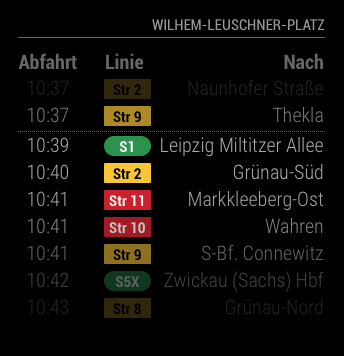

# MMM-PublicTransportLeipzig

[](LICENSE)
[](https://codeclimate.com/github/raywo/MMM-PublicTransportLeipzig/maintainability)
[](https://codeclimate.com/github/raywo/MMM-PublicTransportLeipzig/test_coverage)
[](https://greenkeeper.io/)
[](https://david-dm.org/raywo/MMM-PublicTransportLeipzig)
[](https://snyk.io/test/github/raywo/mmm-publictransportleipzig?targetFile=package.json)
[](https://gitter.im/raywo)


MMM-PublicTransportLeipzig is a module for the [MagicMirror](https://github.com/MichMich/MagicMirror) project by
[Michael Teeuw](https://github.com/MichMich).

It shows live public transport information for Leipzig based on LVB (Leipziger Verkehrsbetriebe) data.  
MMM-PublicTransportLeipzig uses the [lvb](https://github.com/juliuste/lvb) REST API by [juliuste](https://github.com/juliuste).

## Notes
The module is working fine. But there are some known issues. (See [Known Issues](#known-issues).)

If you would like a more stable version please check out [MMM-PublicTransportHafas](https://github.com/raywo/MMM-PublicTransportHafas). This module uses data from the [hafas-client](https://github.com/derhuerst/hafas-client) which is much more reliable than the lvb REST API and has live information too. MMM-PublicTransportHafas comes preconfigured for Leipzig.

## How it works
After you installed MMM-PublicTransportLeipzig you just configure it to your needs and that’s it. The only config you really need to set is the station you want to display. Everything else is covered by defaults but can be configured by you anyway. For instance you can enter a time you need to get to the station (`timeToStation` in config). Then the module calculates the next reachable departures and draws a line between reachable and unreachable departures.

For details see the [Configuration](#configuration) section.

## Screenshot



The screenshot shows departures from Wilhelm-Leuschner-Platz where the first two are not reachable due to the `timeToStation` setting.

## Preconditions

* MagicMirror<sup>2</sup> instance
* Node.js version > 6.0.0
* npm

## Installation

Just clone the module into your MagicMirror modules folder and execute `npm install` in the module’s directory:

```
git clone https://github.com/raywo/MMM-PublicTransportLeipzig.git
cd MMM-PublicTransportLeipzig
npm install
```

## Update

Just enter your MMM-PublicTransportLeipzig folder in the MagicMirror’s modules folder and execute the following commands in the module’s directory:

```
git pull
npm install
```

## How to get the `stationId`

### Happy case

You can provide a station name or a station ID to define your departure station. If your station has a `stationID` it is recommended to use it. If not you can be lucky and get away with just providing the station name. (See [Known Issues](#knwon-issues).)

For your convenience there is a script in the MMM-PublicTransportLeipzig folder you can edit and execute to get the `stationID` for your station.

Find the file `stationID_Query.js` and edit the second line and fill in the name of your station:

```
// Enter your station name here:
const stationName = "Goerdelerring";
```

Then run the script inside the module folder using

```
node stationID_Query.js
```

The result will look like this:

```
[ { id: '12996',
    type: 'station',
    name: 'Leipzig, Goerdelerring',
    coordinates: { longitude: 12.372838780123, latitude: 51.344361907514 } } ]
```

The number noted after `id` is your `stationID` (in this case 12996).

If this query returns more than one result you have to pick the right station and you must provide the `stationID` in the config or else the module won’t work.  

### Unhappy case  

For some station names the query will return `[]`. This means the station is not known to the API. The reason may be that you spelled the name wrong or it is known to the API by another name. If you query for “Nonnenstraße” you will get `[]`. If you query for “Nonnenstr.” instead you will get the correct result.

There is a third option: the station name is not known to the API but departures can be queried nevertheless. “Klingerweg” is such an example. The stations query returns `[]` and therefore there is no `stationID` for “Klingerweg” but it is still a valid station name for a departure query. You can test that by using the `departure_Query.js` script provided with this module. Just edit the `departureStation` value and run the script.

```
// Enter your station name here:
const departureStation = "Klingerweg";
```

Run in the modules folder

```node departure_Query.js```

… and you’ll get a result like this:

```
[ { line:
     { id: '2',
       name: 'Str    2',
       class: 'StN',
       operator: 'LVB',
       direction: 'Naunhofer Straße' },
    timetable: [ [Object], [Object], [Object], [Object] ] },

*snipped a bit*

  { line:
     { id: '2',
       name: 'Str    2',
       class: 'StN',
       operator: 'LVB',
       direction: 'Meusdorf' },
    timetable: [ [Object], [Object] ] } ]
```

Congratiulations! If you receive an answer like this your station name is known by the system. If not there is currently no way to make it work.


## Configuration

The module quite configurable. These are the possible options:

|Option|Description|
|-------------------------------|--------------------------------------------------|
|`hidden`                       |Visibility of the module.<br><br>**Type:** `boolean`<br>**Default vaule:** `false`|
|`name`                         |The name of the module instance (if you want multiple modules).<br><br>**Type:** `string`<br>|
|`stationName`                  |The name of the station you want the departures to be displayed for. (See [How to get the `stationId`](#how-to-get-the-stationid) above.)<br><br>**Type:** `string` This value is **REQUIRED**.<br>**Example:** `"Goerdelerring"`<br>**Default value:** `"Wilhelm-Leuschner-Platz"`<br><br>**Note:** If you provide a valid `stationId` this value is only used as the heading of the module. If you provide `99999` as `stationId` this name is used to actually query the API for departures from this station. |
|`stationId`                    |The ID of the station. How to get the ID for your station is described [above](#how-to-get-the-stationid). <br><br>**Type:** `integer` This value is **REQUIRED**.<br>**Default value:** `"12992"`<br><br>**Note:** If your station doesn’t have an ID use `99999` here. The module will then use `stationName` for it’s queries. Make sure this will work (see [above](#unhappy-case)).|
|`headerPrefix`                 |The text to be prepended to the station name in the module heading.<br><br>If you want the module heading to read “start at Goerdelerring” you need to provide “start at” as value for `headerPrefix`.<br><br>**Type:** `string`.<br>**Example:** `"start at"`<br>**Default value:** `""`<br><br>**Note:** A blank is always inserted between `headerPrefix` and `stationName`.|
|`directions`           |The directions you want to be displayed.<br><br>**Type:** `string array`<br>**Example:** `[ "Mockau", "Lausen" ]`<br>**Default value:** `[]`<br><br>**Note:** If you are only interested in the departures in a certain direction provide **all** directions you want to be included. The direction is given as it is displayed on the buses or trams. Keep in mind that some lines can have multiple end stations. For instance the eastbound line of *Str 1* can end at *“Mockau, Post”* or *“Schönefeld”*. You need to include both values in `directions` to see both lines. For directions like *“Leipzig, Lausen”* it’s enough to include *“Lausen”* in the array.|
|`ignoredLines`                 |The lines you don’t want to be displayed.<br>Add all lines you want to exclude to this array. <br><br>**Type:** `string array`<br>**Example:** `[ "Str 1", "Bus N1" ]`<br>**Default value:** `[]`<br>**Possible values:** All valid line names like `'Str 1'` (for tram) , `'Bus 89'`(for buses), `'S2'` (for suburban) , etc.|
|`excludedTransportationTypes`  |Transportation types to be excluded from appearing on a module instance can be listed here.<br><br>**Type:** `string`<br>**Example:** `[ "StN", "Str" ]` (excludes all tram lines)<br>**Default vaule:** `[]` <br>**Possible values:** `BuN` (buses), `StN`, `Str` (trams), `s` (suburban)<br><br>**Note:** If you want to exclude tram lines make sure you list `StN` **and** `Str` since the API uses both values to denote a tram line.|
|`marqueeLongDirections`        |Displays long direction descriptions as a scrolling text if set to `true`. If set to `false` long descriptions are trimmed.<br><br>**Type:** `boolean`<br>**Default vaule:** `true`<br><br> **Note:** If the rendering of the scrolling text is not smooth (especially on slow hardware like older Raspberry Pis) turn this feature off.|
|`interval`                     |Determines how often the display should be updated. The value is given in seconds.<br><br>**Type:** `integer`<br>**Example:** `360` (6 minutes) <br>**Default value:** `120` (2 minutes)|
|`timeToStation`                |The time in minutes it takes you to get to the specified station.<br><br>**Type:** `integer`<br>**Example:** `5`<br>**Default vaule:** `10` (10 minutes)|
|`showColoredLineSymbols`       |Display the line symbol should with color (as used by the LVB) or not. If set to `false` the module will display gray labels.<br><br>**Type:** `boolean`<br>**Default vaule:** `true`|
|`useColorForRealtimeInfo`      |Displays the realtime information in colors.<br><br>**Type:** `boolean`<br>**Default vaule:** `true`|
|`showTableHeaders`             |Show the table headers for time, line and direction.<br><br>**Type:** `boolean`<br>**Default vaule:** `true`|
|`showTableHeadersAsSymbols`    |Show the table headers as symbols.<br><br>**Type:** `boolean`<br>**Default vaule:** `true`|
|`maxUnreachableDepartures` |How many unreachable departures should be shown. Only necessary, of you set `timeToStation` > 0<br><br>**Type:** `integer`<br>**Example:** `2` (Shows two departures althoug they couldn’t be reached according to your setting in `timeToStation`<br>**Default vaule:** `3`|
|`maxReachableDepartures`   |How many reachable departures should be shown. If your `timeToStation = 0`, this is the value for the number of departures you want to see.<br><br>**Type:** `integer`<br>**Default vaule:** `7`|
|`fadeUnreachableDepartures`    |Activates/deactivates fading for unreachable departures.<br><br>**Type:** `boolean`<br>**Default vaule:** `true`|
|`fadeReachableDepartures`|Activates/deactivates fading for reachable departures.<br><br>**Type:** `boolean`<br>**Default vaule:** `true`|
|`fadePointForReachableDepartures`|Fading point for reachable departures. Thìs value is also valid for `delay = 0` <br><br>**Type:** `float`<br>**Default vaule:** `0.5` <br>**Possible values:** `0.0 - 1.0`|

Here is an example of an entry in `config.js`:

``` JavaScript
{
  module: "MMM-PublicTransportLeipzig",
  position: "bottom_right",
  config: {
    hidden: false,
    stationName: "Wilhem-Leuschner-Platz",
    stationId: "12992",
    directions: [ "Mockau", "Schönefeld", "Naunhofer", "Meusdorf" ],
	 excludedTransportationTypes: [ "s" ], // no suburban trains will be shown
    //ignoredLines: [ "Str 15" ],
    timeToStation: 5,
    interval: 120,
    marqueeLongDirections: true,
    showColoredLineSymbols: true,
    useColorForRealtimeInfo: true,
    showTableHeadersAsSymbols: false,
    maxUnreachableDepartures: 2,
    maxReachableDepartures: 7,
    fadeUnreachableDepartures: true,
    fadeReachableDepartures: true,
    fadePointForReachableDepartures: 0.25
  }
},
```

## Multiple Modules

Multiple instances of this module are possible. Just add another entry of the MMM-PublicTransportLeipzig module to the `config.js` of your mirror.

## Special Thanks

* [Michael Teeuw](https://github.com/MichMich) for inspiring me and many others to build a MagicMirror.
* [Julius Tens](https://github.com/juliuste) for creating the [lvb](https://github.com/juliuste/lvb) REST API for the virtually non existent LVB-API.
You made my life a lot easier with this!
* The community of [magicmirror.builders](https://magicmirror.builders) for help in the development process and all contributors for finding and fixing errors in this module.


## Known Issues
The API the LVB (Leipziger Verkehrsbetriebe) provides is very basic and has some issues:

* Not all stations have a `stationID` assigned (for instance “Klingerweg”).
* Some stations are stored with unusal names. For instance “Nonnenstraße” is stored as “Nonnenstr.”
* Most station which are also suburban (S-Bahn) or long distance train stops cannot be queried.
* The API produces quite often errors because of being not reachable or sending data in the wrong format.

Stations without an assigned `stationID` can be used as starting points for the module as long as a query for their name returns a single result. In the example above “Klingerweg” has no `stationID` assigned but a stations query for “Klingerweg” returns just one result so it can be used. On the other hand it is not possible to set “Hauptbahnhof” as a starting point for the module. Since “Hauptbahnhof” has no `stationID` assigned and a station query returns multiple results.

## Issues

If you find any problems, bugs or have questions, please [open a GitHub issue](https://github.com/raywo/MMM-PublicTransportLeipzig/issues) in this repository.
